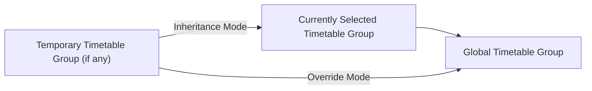

# Time Table
 

A timetable is the specific arrangement of courses on a given day, consisting of courses and trigger rules. The time arrangement of the timetable comes from the corresponding time layout. Each timetable is set independently. Before entering a timetable, you should first set up a time layout (see “[Time Layout](time-layout.md)”).

## Courses

In the timetable, you can assign a subject to each class period defined in the corresponding time layout. Subjects come from those defined in the Subjects tab (see “[Subjects](subject.md)”).

## Trigger Rules

You also need to set trigger rules for the timetable. When all trigger rules are satisfied, the timetable will be activated, displayed as the daily timetable in the main interface (as shown in the figure).

You can also disable automatic activation of the timetable. In this case, the timetable will not load automatically and can only be activated manually.

## Temporary Timetable and Temporary Layer

If there are changes in the day’s teaching plan and you need to activate a timetable for a specific day, you can temporarily activate one via the Temporary Timetable menu. This timetable will bypass the trigger rules and activate directly, appearing in the main interface. Temporary timetables are cleared when the application exits or when the next day arrives. You can also disable a temporary timetable by clicking Clear Temporary Timetable or by unchecking the activated timetable.

To enter the Temporary Timetable menu, click the Temporary Timetable button on the toolbar of the Timetable tab, or select Load Temporary Timetable in the application menu.

In addition, you can create a temporary layer for a timetable. A temporary layer is similar to a temporary timetable and will be deleted the next day. However, you can edit the course arrangements in the temporary layer separately without affecting the original timetable. When a temporary layer is enabled, it automatically overrides any temporary timetable.

You can convert a temporary layer into a regular timetable from its timetable information screen (as shown in the figure).

## Switching Courses

Open the main application menu and click Switch Course to temporarily swap courses. Here is how to use this feature:

- Open the main menu and click Switch Course to open the switching interface.

- Select the course you want to adjust.

- Select the course you want to swap with the previously chosen one. Click the highlighted button to toggle the switching mode. Then click Confirm Switch to complete the swap.

After switching, the application will create a temporary layer of the original timetable and adjust the schedule on that layer. The adjustment is only effective for the current day. You can also check the Permanent Switch box to directly write the switch into the original timetable.

## Timetable Groups

You can group timetables with timetable groups and flexibly enable a batch of them. ClassIsland will only load timetables from enabled groups and from the global timetable group. Among them, the currently active group will take priority.

In the timetable editor, timetables are displayed grouped by timetable groups.

You can also set temporary timetable groups to temporarily activate a batch of timetables. Right-click on the timetable group you want to activate, then select Temporary Activate. By default, the temporary group will remain active just long enough to cycle through all timetables in that group. You can adjust the expiration date as needed.

::: note TL;DR

In summary, timetables are loaded with the following priority from left to right:

:::

If you choose Inheritance mode, activating a temporary timetable group will also load the current group and the global group, with the temporary group taking priority.

If you choose Override mode, only the temporary group and the global group will be loaded.
