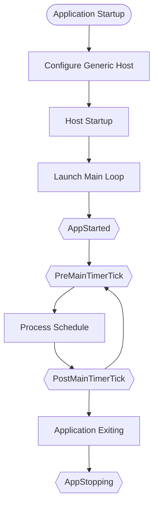

# Events

Events are an important way to respond to ClassIsland's lifecycle changes and class schedule state changes.

The .NET Generic Host and ClassIsland provide a series of events that you can subscribe to by accessing corresponding services.

## Lifecycle

:::details Lifecycle Event Diagram

The following diagram illustrates ClassIsland's lifecycle and event triggering:



:::

[[TOC]]

## Application Lifecycle Events

These events are triggered when the application lifecycle changes. To subscribe to these events, you need to obtain the current application instance using the following code:

```csharp
var app = AppBase.Current;

// Register application startup completion event
app.AppStarted += (o, e) => Console.WriteLine("AppStarted");
```

### Application Startup Completed `AppStarted`

Triggered after the application has finished starting up.

**Event Name:** `AppStarted`

**Params:** _None_

### Application Stopping `AppStopping`

Triggered when the application is exiting.

::: warning
Do not perform asynchronous operations in the event handler for this event.
:::

**Event Name"** `AppStopping`

**Params** _None_

## Main Timer Events

These events are triggered every 50ms and are suitable for polling operations. To subscribe to these events, you need to obtain the `ClassIsland.Core.Abstractions.Services.ILessonService` service as described in the dependency injection section of the [Basics](./basics.md#依赖注入) documentation.

### Pre-Lesson Processing Event

Triggered before the main timer starts processing class schedule information.

**Service:** `ClassIsland.Core.Abstractions.Services.ILessonService`

**Event Name:** `PreMainTimerTicked`

**Params:** _None_

### Post-Lesson Processing Event

Triggered after the main timer finishes processing class schedule information.

**Service:** `ClassIsland.Core.Abstractions.Services.ILessonService`

**Event Name:** `PostMainTimerTick`

**Params:** _None_

## Class Schedule Events

The following events are triggered when the corresponding state of the class schedule occurs.

### Class Start Event

Triggered when entering a time point of the class type.

**Service：** `ClassIsland.Core.Abstractions.Services.ILessonService`

**Event Name：** `OnClass`

**Params：** _None_

### Break Time Event

Triggered when entering a time point of the break type.

**Service：** `ClassIsland.Core.Abstractions.Services.ILessonService`

**Event Name：** `OnBreakingTime`

**Params：** _None_

### End of School Event

Triggered after school (when the current time exceeds the last time point of today's schedule).

**Service：** `ClassIsland.Core.Abstractions.Services.ILessonService`

**Event Name：** `OnAfterSchool`

**Params：** _None_

### Time State Changed Event

Triggered when the current time state changes.

**Service：** `ClassIsland.Core.Abstractions.Services.ILessonService`

**Event Name：** `CurrentTimeStateChanged`

**Params：** _None_
