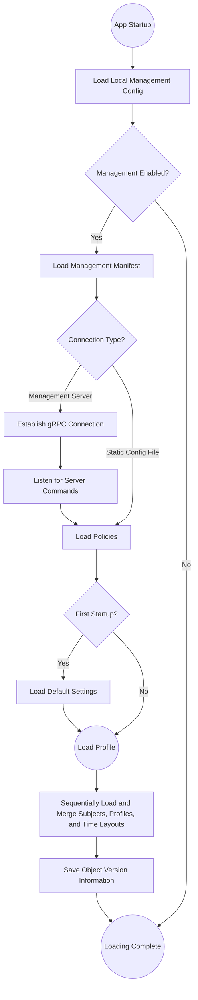

The IT department of a school/organization can use the Centralized Management feature to distribute timetables, time layouts, subjects, and other information to all ClassIsland instances in the school. It can also centrally adjust software settings and restrict certain features, improving management convenience.

## Getting Started

This feature supports deployment via static configuration files or via a management server. You can freely choose the deployment method depending on your needs

### Using Static Configuration Files

You can manually create a centralized management configuration file and host it on a static website.

[🚀Tutorial](tutorial-create-management-config.md)

[📖Feference Docs](configure.md)

### Management Server

_🚧 In development_

### Which One to Choose?

(WIP)

## Loading Process

Centralized management configurations are loaded according to the following process. Expand to view details:

::: details Expand Flowchart

:::

The retrieved configuration files (such as manifests, policies, timetables, etc.) are cached locally and only re-fetched when updates are available. Once centralized management is enabled, the managed profile is forcibly loaded, and its data does not interoperate with ordinary profiles.
